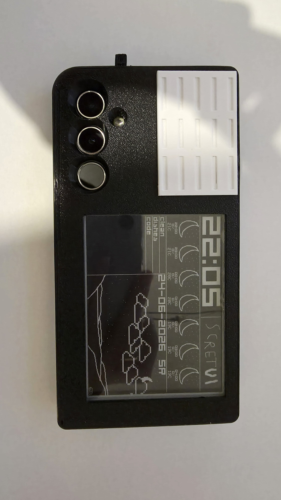
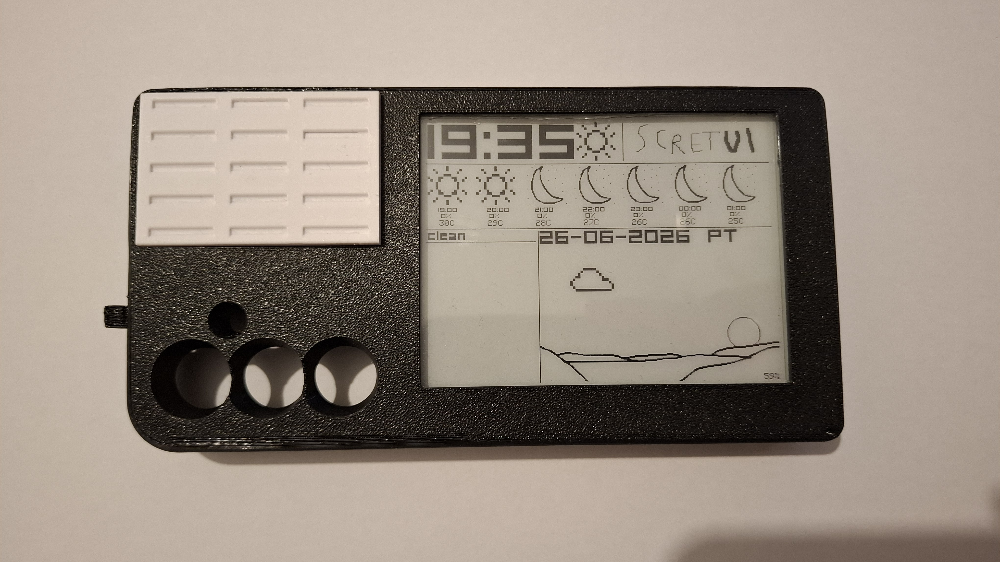
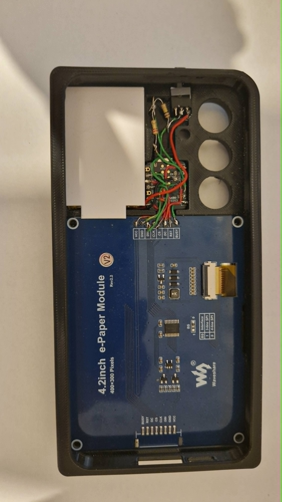
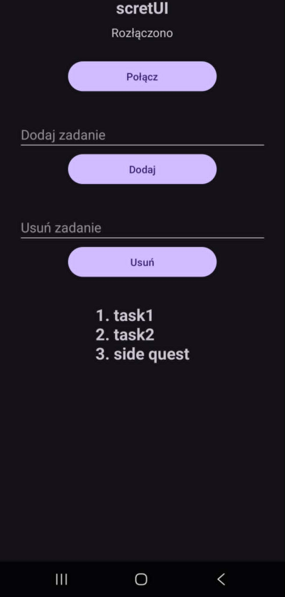
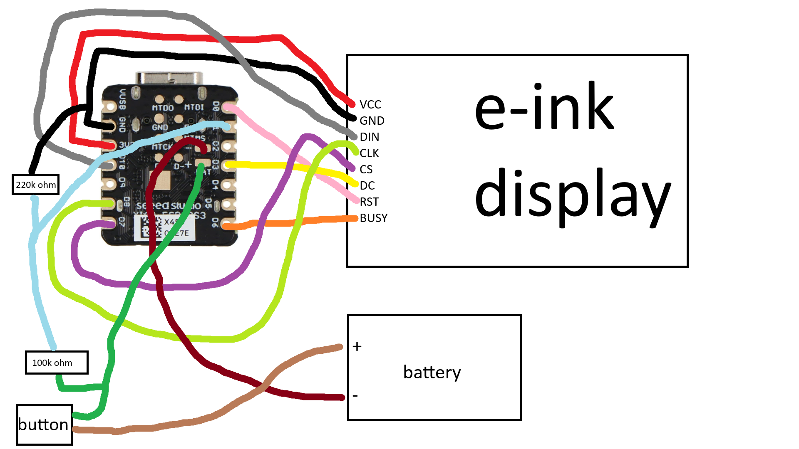
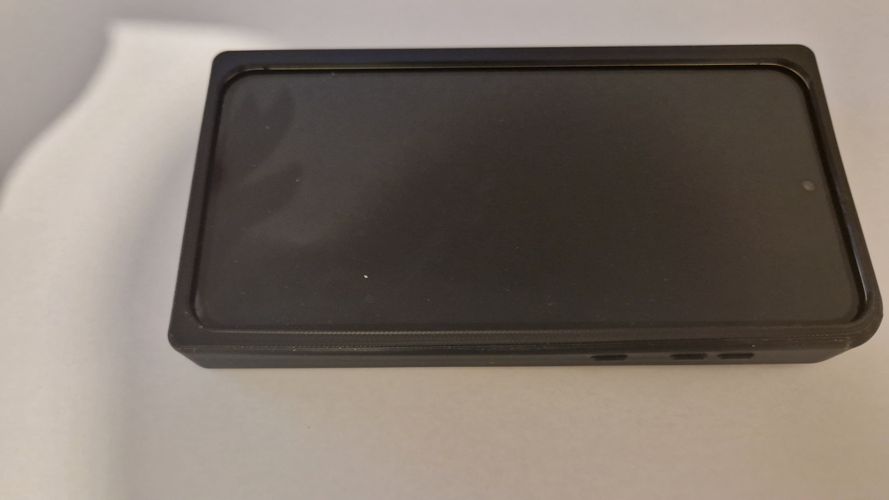

# scretUI
A 3D-printed smartphone case with a 4.2" e-ink display for Samsung Galaxy A55 5G.

## Features:
The screen displays:
- current time (+/- 5 minutes)
- 7 hour weather forecast with dynamic icons
- to-do list
- current date
- simple animated landscape that changes based on weather conditions (sun moves across the sky, 1–10 clouds slowly drift across the scene)

  
  

## Used parts:
- waveshare 13353
- xiao seed esp32 s3
- 100k ohm resistor
- 220k ohm resistor
- 1500mAh 3.7V Li-Pol battery (50x34x8mm)
- 9x8x8mm button
  

## How it works:
The phone connects to the ESP32 via BLE. The mobile app fetches weather data (Open-Meteo API), then sends it along with:
- current time
- date
- to-do list
- next wake-up interval

The ESP32 updates the e-ink display and then enters deep sleep for the requested period. The cycle then repeats.

## How to make:
The phone case is printed in TPU 90A with 15% infill, while the battery enclosure is printed in PETG. Install Arduino IDE, then go to Preferences and add https://espressif.github.io/arduino-esp32/package_esp32_index.json in “Additional Boards Manager URLs”, open Boards Manager and install the ESP32 package by Espressif Systems, select the ESP32-S3 board (e.g. ESP32S3 Dev Module) under Tools, set Tools → CPU Frequency to 80MHz, connect the ESP32-S3 board to your computer via USB, choose the correct COM/tty port, then paste the code from esp32Code into the Arduino sketch, after which you can click Upload.

## AI usage:
AI was used for writing some auxiliary functions, assisting with Kotlin development and BLE integration, and supporting debugging.
